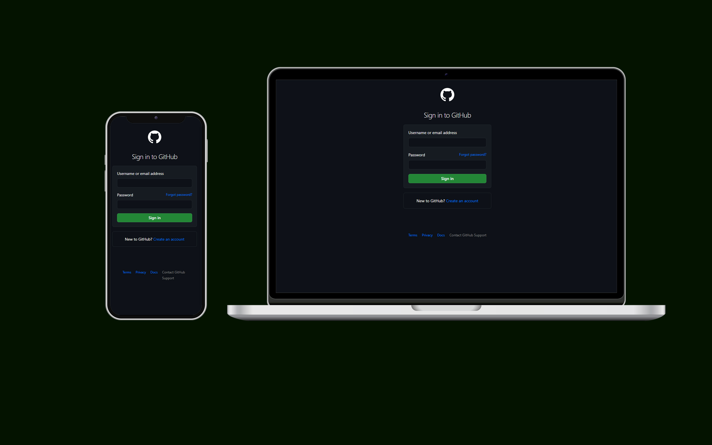

<<<<<<< HEAD
<h1 align="center">Clone-Github</h1>

  

  

## 💻 Projeto

Projeto do clone do Login do GitHub. criado como treinamento para aprimorar minhas habilidades em HTML e CSS.

- [Acesse o projeto](clone-github-one.vercel.app)

## 🚀 Tecnologias

Esse projeto foi desenvolvido com as seguintes tecnologias:

- HTML e CSS
- Git e Github
- Photoshop
=======
# Clone GitHub 

Ferramentas usadas: Html & CSS

link para acesso: http://127.0.0.1:5500/index.html

>>>>>>> 9786886e42642596ab2ee5a187ef52170413f121
